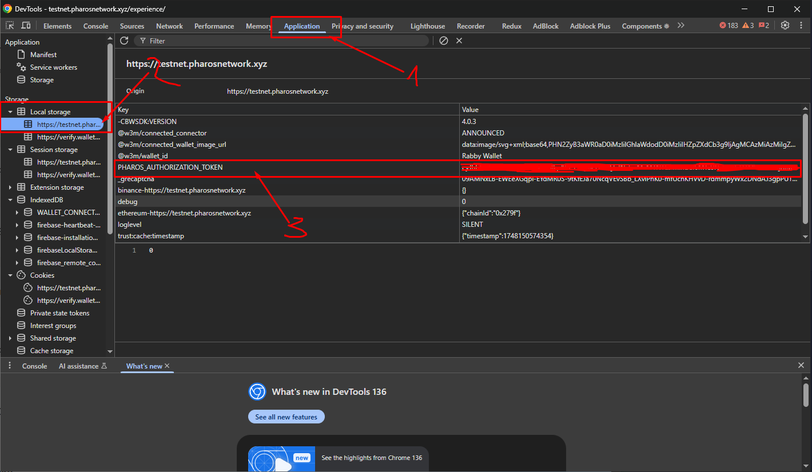

# Pharos Testnet Bot

A Python-based bot for interacting with the Pharos Testnet. This bot automates various Testnet operations including token swaps and check-ins.

## Features

### 1. Token Swaps
- Automated token swaps between various pairs:
  - PHRS (Native Token) ↔ USDT
  - PHRS ↔ USDC
  - PHRS ↔ WPHRS (Wrapped PHRS)
  - WPHRS ↔ USDT
  - WPHRS ↔ USDC
- Configurable parameters:
  - Number of swaps per session
  - Percentage of balance to swap
  - Retry count for failed transactions
- Automatic gas optimization using EIP-1559
- Smart routing through WPHRS for optimal paths

### 2. Daily Check-in
- Automated check-in functionality
- Requires authentication key

## Setup

1. Install Python 3.8 or higher

2. Install dependencies:
```bash
pip install -r requirements.txt
```

3. Create your configuration file:
```bash
cp data/configuration.yaml.example data/configuration.yaml
```
Then edit `data/configuration.yaml` with your settings.

## Configuration Properties

The configuration file contains the following sections:

### Accounts
```yaml
accounts:
  - private_key: "your_private_key_here"  # Your wallet's private key
    proxy: null  # Optional proxy URL (e.g., "http://user:pass@ip:port")
    auth_key: "value from LocalStorage on https://testnet.pharosnetwork.xyz/experience/"
```

To get `auth_key` follow these instructions:

- Open https://testnet.pharosnetwork.xyz/experience/ 
- Connect your wallet
- Open DevTools (CTRL + SHIFT + I)
- Navigate to Application -> LocalStorage
- Copy value from `PHAROS_AUTHORIZATION_TOKEN`


### Settings
```yaml
settings:
  # Swap feature settings
  swaps:
    count_of_swaps: [1, 3]  # Range for random number of swaps per session
    percentage_of_balance: [10, 30]  # Range for random percentage of balance to swap
    retry_count: 3  # Number of retry attempts for failed transactions

  # Check-in feature settings
  checkin:
    enabled: true  # Whether to enable check-in feature
    auth_key: "your_auth_key_here"  # Authentication key for check-in

  # General settings
  accounts_mode: "SEQUENTIAL"  # How to process accounts: "SEQUENTIAL" or "PARALLEL"
  randomize_feature_order: false  # Whether to randomize the order of features
```

## Running the Bot

1. Basic usage:
```bash
python main.py
```

2. With custom configuration file:
```bash
python main.py -c path/to/your/config.yaml
```

## Logging

The bot provides detailed logging:
- Console output with colored formatting
- File logging in `logs/app.log`
  - Rotates at 10 MB
  - Retains logs for 1 month
  - Includes timestamps and log levels

## Security Considerations

- Never share your private keys
- Store configuration files securely
- Use environment variables for sensitive data in production
- Review transaction parameters before deployment

## Error Handling

The bot includes:
- Automatic retry mechanism for failed transactions
- Gas price optimization
- Insufficient balance checks
- Detailed error logging

## Network Configuration

The bot connects to:
- RPC: https://testnet.dplabs-internal.com
- Chain ID: 688688
- Explorer: https://testnet.pharosscan.xyz

## Development

To add new features or modify existing ones:
1. Features are modular and located in the `features/` directory
2. Services are in the `services/` directory
3. Use dependency injection container in `bootstrap/container.py`
4. Follow the existing pattern for new feature implementation 